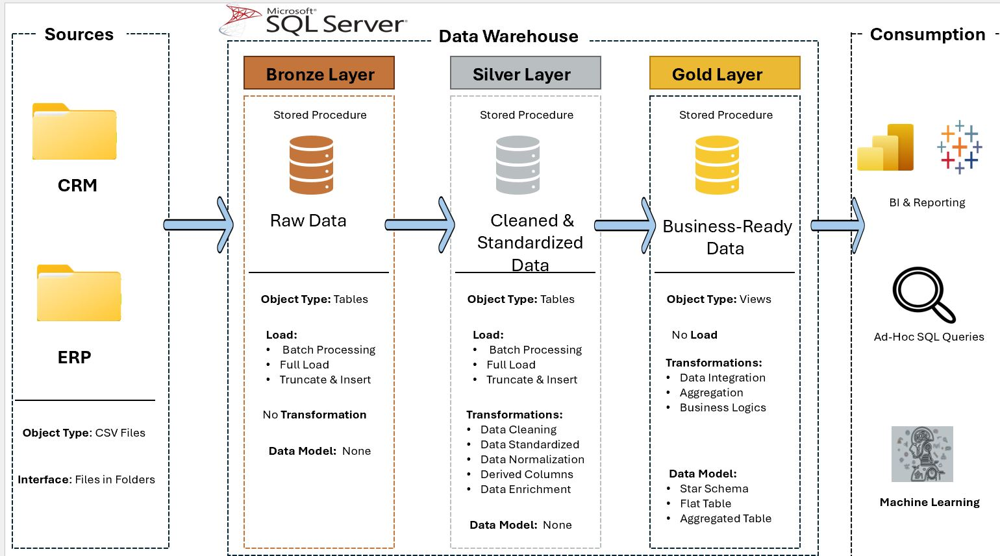
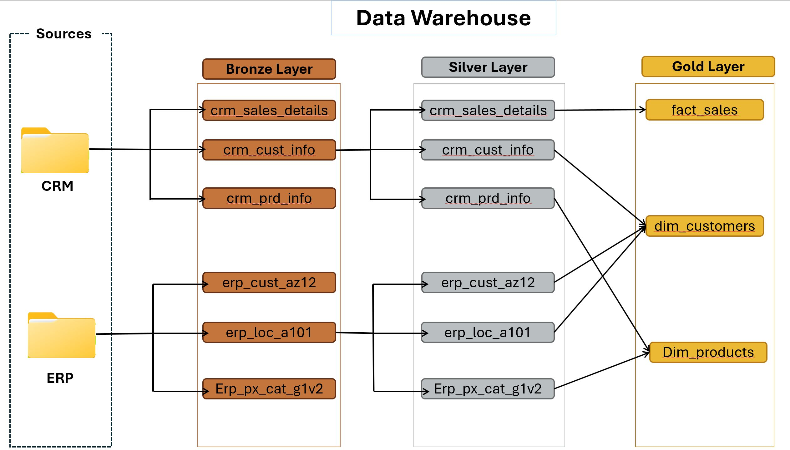
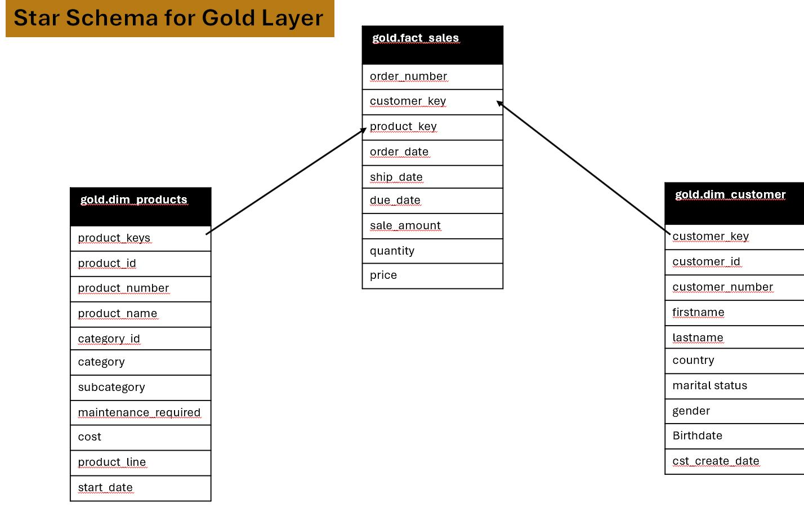

# 🏗️ SQL Data Warehouse Project (Medallion Architecture)

Building a modern data warehouse with SQL Server, using Medallion Architecture (Bronze, Silver, Gold) — includes ETL, data modeling, and analytics.


# 🛠️ Sales Data Pipeline Project

This project showcases an end-to-end ETL pipeline using SQL, simulating the flow of sales data from CRM and ERP systems into a modern data warehouse. The architecture follows a  Medallion Architecture pattern ( i.e **Bronze** → **Silver** → **Gold** stages) to transform raw data into analytics-ready formats.

---

# 📖 Project Overview

The project involves:

1. **Data Architecture**: Designing a Modern Data Warehouse Using Medallion Architecture Bronze, Silver, and Gold layers.
2. **ETL Pipelines**: Extracting, transforming, and loading data from source systems into the warehouse.
3. **Data Modeling**: Developing fact and dimension tables optimized for analytical queries.
4. **Analytics & Reporting**: Creating SQL-based reports and dashboards for actionable insights.

---

## 🎯 Project Goals and Requirements

Data Sources: Import data from two source systems (ERP and CRM) as CSV files.
Data Quality: Pre-clean and fix data quality issues prior to analysis.
Integration: Integrate both sources into a single, user-friendly data model for analytical queries.
Scope: Use the most recent dataset only; historization of data is not required.
Tools used: Microsoft SQL Server, T-SQL
Documentation: Document the data model well in order to address business stakeholders as well as analytics teams

---
## 🧱 Database and Schema Setup
Before creating tables or views, the project defines:
* A database: `Datawarehouse` 
* Three schemas: `bronze`,  `silver`, and `gold`

Script:

```sql

-- Create the data warehouse database
CREATE DATABASE Datawarehouse;
GO

-- Use the database
USE Datawarehouse;
GO

-- Create schemas
CREATE SCHEMA bronze;
CREATE SCHEMA silver;
CREATE SCHEMA gold;
```
📂 You’ll find this script in scripts/database_setup.sql.

---
# 📁 Project Structure
```
data-warehouse-project/
│
├── datasets                          |  # Raw datasets used for the project (ERP and CRM data)
├── scripts                           |  # SQL scripts for ETL and transformations
│  ├── database_setup.sql             |  # Create database and schemas
│  ├── bronze                         |  # Scripts for extracting and loading raw data
│  ├── silver                         |  # Scripts for cleaning and transforming data
│  ├── gold                           |  # Scripts for creating analytical models
│
├── tests/                            |  # Test scripts and quality files
│
├── images                            |  # ERD & architecture diagrams
├── README.md                         |  # Project overview and instructions
├── LICENSE                           |  # License information for the repository
├── .gitignore                        |  # Files and directories to be ignored by Git
└── requirements.txt                  |  # Dependencies and requirements for the project
```
---

## 🔄 Data Pipeline Flow



---

## 🌐 Medallion Layer Descriptions

###  Bronze Layer
- Raw data import (no transformation)
- Includes: crm_cust_info, erp_cust_az12, erp_loc_a101, erp_sales_data
- Stored in `ddl_bronze.sql`

###  Silver Layer
- Cleaned and standardized data
- Data Normalization
- Stored in `ddl_silver.sql`

###  Gold Layer
- Cleaned and trusted views for analysis and Modelled into star schema
- Star schema: fact and dimension tables
- Scripts:
  - `gold_dim_customer.sql`
  - `gold_dim_products.sql`
  - `gold_facts_sales.sql`

 ## 🔧Flow Chart
  

---

## ⭐ Star Schema ERD

**Fact Table**:
- `facts_sales` (sales data)

**Dimension Tables**:
- `dim_customer` (customer attributes)
- `dim_products` (product attributes)
  

---

## 🧹 Data Quality Checks

Stored in `data_quality_checks.sql`

### ✅ Examples:
- Checking for duplicate `customer_id` and `prd_id`
- Cleaning null or invalid genders using fallback from alternate source

```sql
CASE 
  WHEN ci.cst_gndr = 'n/a' OR ci.cst_gndr IS NULL THEN COALESCE(ca.gen,'n/a')
  ELSE ci.cst_gndr
END AS gender
```
- Ensuring only valid products (i.e., `WHERR prd_end_dt IS NULL`) are used
---

## 🔎 SQL Views Created

| View Name           | Description                |
| ------------------- | -------------------------- |
| `gold.dim_customer` | Cleaned customer data      |
| `gold.dim_products` | Product info with category |
| `gold.facts_sales`  | Final sales fact table     |

---

## Skills Demonstrated (Optional)
* SQL Data Modeling
* ETL (Extract, Transform, Load)
* Schema Design
* Data Quality Enforcement
* Star Schema Construction
* Analytical Reporting with SQL

---

# 👤 About Me
👋 Hi, I'm Peter Junior Nwachineke – a passionate Data Analyst with hands-on experience in SQL, Power BI, Excel, and Python. I'm currently pursuing an MBA in International Business Management at ISTEC and building data projects that turn raw information into actionable insights. I'm especially interested in process automation, dashboard reporting, and helping businesses make smarter, data-driven decisions.


📧 [Email](peter.j.nwachineke@gmail.com)

💼 [Connect with me on LinkedIn](https://www.linkedin.com/in/peter-j-nwachineke-819291247/)
